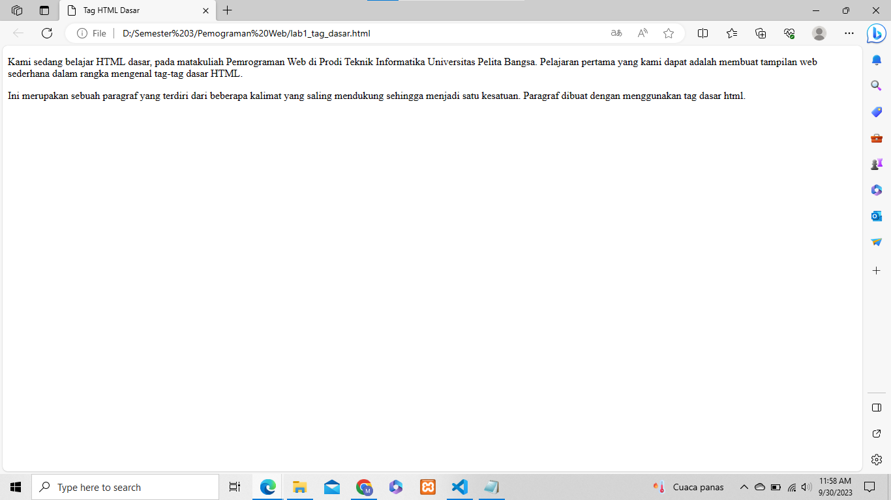
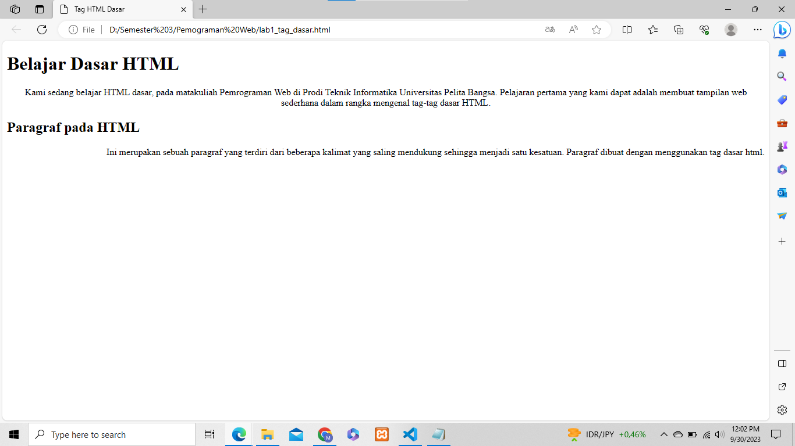

# Lab1Web

## PENGANTAR HTML

- HTML (Hypertest Markup Language) merupakan bahasa markup yang digunakan untuk membuat 
sebuah halaman web dan menampilkan berbagai informasi di dalam sebuah browser. HTML 
berupa kode-kode tag yang menginstruksikan browser untuk menghasilkan tampilan sesuai 
dengan yang diinginkan. HTML saat ini merupakan standar Internet yang didefinisikan dan 
dikendalikan penggunaannya oleh World Wide Web Consortium (W3C).
HTML memiliki struktur yang fleksibel, tanpa lojik serta toleran terhadap kesalahan. Standar 
minimal dari dokumen HTML terdiri dari:<br>
• Document Type Declaration (DTD)<br>
• Document Header<br>
• Document Body<br>


## LANGKAH-LANGKAH PRAKTIKUM

1. Persiapan membuka VSCode dan Browser, kemudian buat file baru pada VSCode <b>lab1_tag_dasar.html</b>
2. Tambahkan tag dasar dokumen HTML
```html
<!DOCTYPE html>
<html>
<head>
   <title>Tag HTML Dasar </title>
</head>
<body>
    
</body>
</html>
```
- **Contoh gambar**
    <br>

3. Selanjutnya membuat beberapa Paragraf

```html
<!-- Ini adalah paragraf pertama -->
<p>Kami sedang belajar HTML dasar, pada matakuliah Pemrograman Web di Prodi Teknik Informatika Universitas Pelita Bangsa. Pelajaran pertama yang kami dapat adalah membuat tampilan web sederhana dalam rangka mengenal tag-tag dasar HTML.</p>
<!-- Ini adalah paragraf kedua -->
<p>Ini merupakan sebuah paragraf yang terdiri dari beberapa kalimat yang saling mendukung sehingga menjadi satu kesatuan. Paragraf dibuat dengan menggunakan tag dasar html.</p>
```

- **Contoh gambar**
    <br>

4. Kemudian atur atribut paragraf seperti berikut, dan amati perubahanya.

```html
<!-- Ini adalah paragraf pertama -->
<p align="center">Kami sedang belajar HTML dasar, pada matakuliah Pemrograman Web di Prodi Teknik Informatika Universitas Pelita Bangsa. Pelajaran pertama yang kami dapat adalah membuat tampilan web sederhana dalam rangka mengenal tag-tag dasar HTML.</p>
<!-- Ini adalah paragraf kedua -->
<p align="right">Ini merupakan sebuah paragraf yang terdiri dari beberapa kalimat yang saling mendukung sehingga menjadi satu kesatuan. Paragraf dibuat dengan menggunakan tag dasar html.</p>
```

- **Contoh gambar**
    <br>

5. Berikutnya menambahkan judul pada paragraf

```html
<!-- judul paragraf pertama -->
<h1>Belajar Dasar HTML</h1>
<!-- judul paragraf kedua -->
<h2>Paragraf pada HTML</h2>
```

- **Contoh gambar**
    <br>

6. Lakukan pemformatan teks yang ada pada paragraf yang sudah ada sebelumnya, mengacu kepada penjelasan materi pemformatan teks, sehingga tampilannya seperti berikut.

```html
<mark>HTML dasar</mark>
<b>Pemrograman Web</b>
<i>Teknik Informatika</i>
<u>Universitas Pelita Bangsa</u>
```

- **Contoh gambar**
    <br>

7. Menyisipkan Gambar, untuk menyisipkan gmbar, siapkan gambar yang akan disisipkan pada halaman web, kemudian simpan file gambar tersebut satu folder dengan file dokumen html. Atau bisa juga menyisipkan gambar dari website external.

```html
<!-- sub judul paragraf -->
<h3>Menambahkan Gambar</h3>
<!-- menambahkan gambar pada dokumen -->

```

- **Contoh gambar**
    <br>

8. Gambar akan ditampilkan apa adanya sesuai dengan ukuran aslinya. Untuk mengatur ukuran gambar, dapat digunakan atribut witdh dan height dengan nilai integer yang disesuaikan.

```html
<!-- menambahkan gambar pada dokumen -->

```

- **Contoh gambar**
    <br>

9. Tambahkan hyperlink pada dokumen sebelum heading 1 seperti berikut.

```html
<!-- menambahkan link navigasi -->
<nav>
    <a href="lab1_tag_dasar.html">Dasar HTML</a>
    <a href="lab1_halaman2.html">Halaman 2</a>
    <a href="http://www.google.com">Halaman Web Eksternal Google</a>
</nav>
    <hr>
```

- **Contoh gambar**
    <br>

10. View tampilan halaman 2 dan halaman web eksternal google.

- **Contoh gambar**
<br>
<br>

## PERTANYAAN & JAWABAN
1. Lakukan perubahan pada kode sesuai dengan keinginan anda, amati perubahannya adakah
   error ketika terjadi kesalahan penulisan tag?      
   **Jawaban:**        
   <mark style="background-color:lightblue">Tidak terjadi error, tetapi tag/kode yang tidak sesuai tidak akan ditampilkan pada halaman website.</mark>

2. Apa perbedaan dari tag p dengan tag br, berikan penjelasannya!        
   **Jawaban:**         
   <mark style="background-color:lightblue">Tag p digunakan untuk membuat paragraf, sedangkan tag br digunakan untuk memberikan enter pada paragraf.</mark>

3. Apa perbedaan atribut title dan alt pada tag img, berikan penjelasannya!  
   **Jawaban:**        
   <mark style="background-color:lightblue">Atribut title akan muncul jika kursor diarahkan keobjek/gambar, sedangkan atribut alt(alternatif) akan muncul jika user tidak bisa menampilkan gambar atau jaringan internet tidak bisa menginput gambar.</mark>

4. Untuk mengatur ukuran gambar, digunakan atribut width dan height. Agar tampilan gambar proporsional sebaiknya kedua atribut tersebut diisi semua atau tidak? Berikan penjelasannya!        
   **Jawaban:**        
   <mark style=background-color:lightblue>sebaiknya hanya mengisi atribut widht saja karna dengan mengisi atribut widht saja itu sudah termasuk height, contoh : jika saya mengisi widht="100" maka otomatis height = "100" jadi height tersebut mengikuti widhtnya</mark>

5. Pada link tambahkan atribut target dengan nilai atribut bervariasi ( \_blank, \_self, \_top,
\_parent ), apa yang terjadi pada masing-masing nilai antribut tersebut?  
**Jawaban:**         
  <ul >
  <li><mark style=background-color:lightblue>_blank: Ketika Anda menggunakan target="_blank", tautan akan dibuka dalam jendela atau tab browser yang baru, terpisah dari halaman saat ini. Ini akan memungkinkan pengguna tetap berada di halaman asal sambil mengakses tautan yang dibuka dalam jendela baru.</mark></li>

  <li><mark style=background-color:lightblue>_self: Nilai ini adalah nilai default. Ketika Anda menggunakan target="_self", tautan akan dibuka dalam jendela atau tab yang sama dengan halaman saat ini. Ini adalah perilaku standar jika Anda tidak menentukan nilai target.</mark></li>

  <li><mark style=background-color:lightblue>_top: Ketika Anda menggunakan target="_top", tautan akan membuka halaman baru dalam jendela atau tab yang sama seperti _self, namun jika halaman tersebut merupakan frame dalam struktur frame HTML, maka halaman baru tersebut akan menggantikan seluruh frame tersebut. Ini akan mengarahkan tautan ke halaman yang paling atas dalam hierarki frame.</mark></li>

  <li><mark style=background-color:lightblue>_parent: Jika Anda menggunakan target="_parent", tautan akan membuka halaman baru dalam jendela atau tab yang sama seperti _self, tetapi jika halaman tersebut merupakan bagian dari struktur frame HTML, maka halaman baru tersebut akan menggantikan frame yang berisi halaman saat ini (frame yang berada satu tingkat di atas dalam hierarki)</mark>.</li>

  </ul>